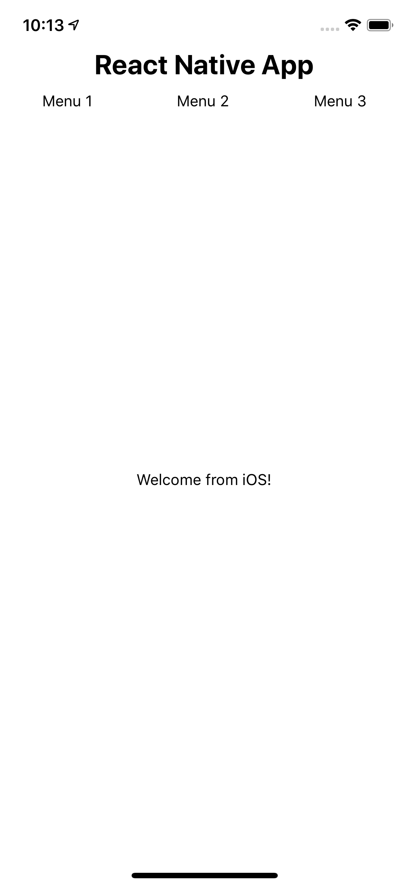
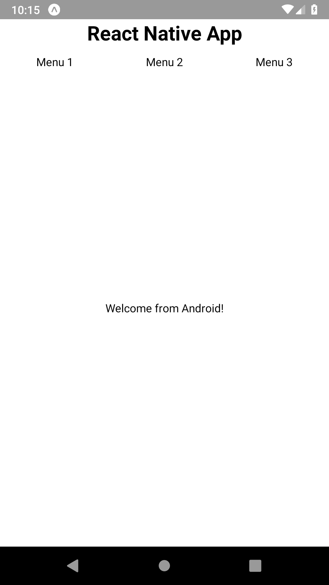

# 00-views

The purpose of this exercise is to get familiar with RN. You will write your first components and learn how to position them on the screen. You will also figure out how to implement the same component differently depending on the platform (iOS, Android).

- You'll have to use a mix of Views with flexDirection; 'column' (default) and 'row': https://facebook.github.io/react-native/docs/flexbox
- You might have components that render outside of the screen due to the device rounded corners or camera notches. Use the [SafeAreView](https://facebook.github.io/react-native/docs/safeareaview) component (iOS) to take these boundaries into account. On Android, you will need to use general `View` and apply paddings by yourself.
- Parts of the code will be different for iOS/Android. See the platform specific code documentation: https://facebook.github.io/react-native/docs/platform-specific-code

By the end of this exercise, your application should look like this:

<table style="width:100%;display:table">
  <tr>
    <th>iOS</th>
    <th>Android</th>
  </tr>
  <tr>
    <td></td>
    <td></td>
  </tr>
</table>
