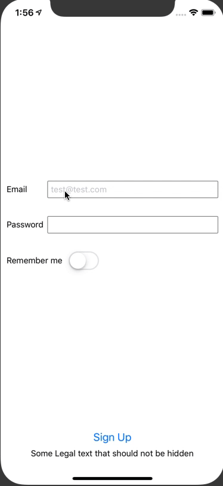
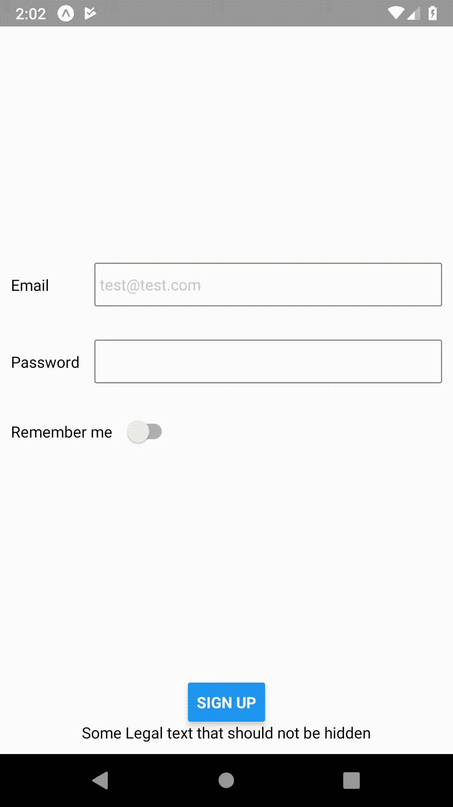

The purpose of this exercise is to get to know the [TextInput](https://facebook.github.io/react-native/docs/textinput) component and make it behave properly. 

We'll also use the [Switch](https://facebook.github.io/react-native/docs/switch) component which is an on/off toggle.

By the end of this exercise, your application should look like this:

<table style="width:100%;display:table">
  <tr>
    <th>iOS</th>
    <th>Android</th>
  </tr>
  <tr>
    <td></td>
    <td></td>
  </tr>
</table>

* Once you've done editing the email field, you should be able to click on the `next` button to switch to the password field.
* Characters from the password field must be hidden
* You will have to use the [KeyboardAvoidingView](https://facebook.github.io/react-native/docs/keyboardavoidingview) to avoid the keyboard going over the `Sign Up` button.