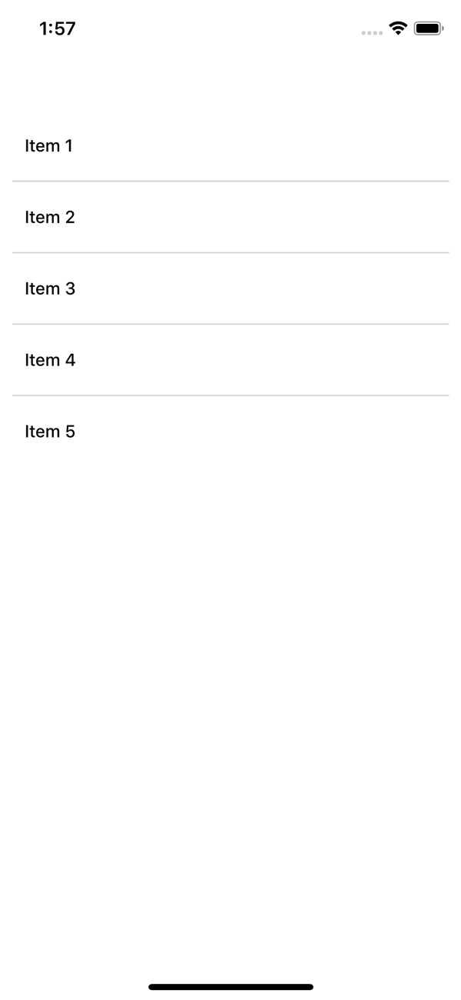
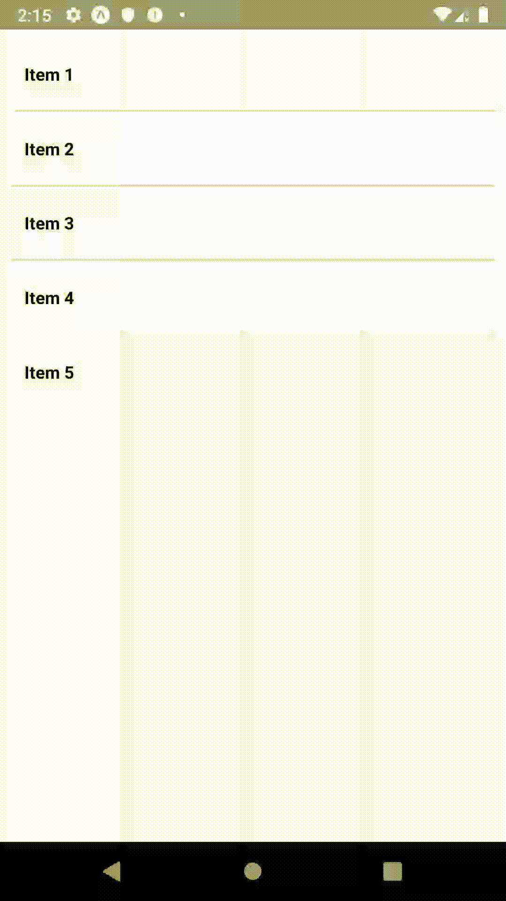

In this exercise, we'll play with the [FlatList](https://facebook.github.io/react-native/docs/flatlist.html) component.

While you can create lists with a [ScrollView](https://facebook.github.io/react-native/docs/scrollview.html) (e.g. inside a SV, .map on your array of data & render a Text component for each of your items), it may not be the best solution for long lists of data. This is due to the fact that ScrollView renders all the elements at once (even if not shown) which will contribute to performance decreases.

On the other hand, FlatList renders items lazily, just when they are about to appear on the screen. It also supports other features such as rendering separators between items.

By the end of this exercise, your application should look like this:

<table style="width:100%;display:table">
  <tr>
    <th>iOS</th>
    <th>Android</th>
  </tr>
  <tr>
    <td></td>
    <td></td>
  </tr>
</table>

* Call the getItems function from common/api.js (using React's useEffect hook?) and store the items in your component's state
* Use a FlatList to display the items
* When an item is clicked, show/hide its description placed below its name To enable clicks on an item, check the [TouchableOpacity](https://facebook.github.io/react-native/docs/touchableopacity) component
* Implement a pull-to-refresh feature which will call getItems again upon refresh. Use FlatList's refreshing and onRefresh props to get it done (an ActivityIndicator will be shown by default)
* When an item is long-clicked, an Alert asking for confirmation for item deletion should be shown.
[Alert](https://facebook.github.io/react-native/docs/alert) API
If deletion is confirmed by the user, let's remove the item from our state. The initial list should be shown again when refreshed thanks to our pull-to-refresh