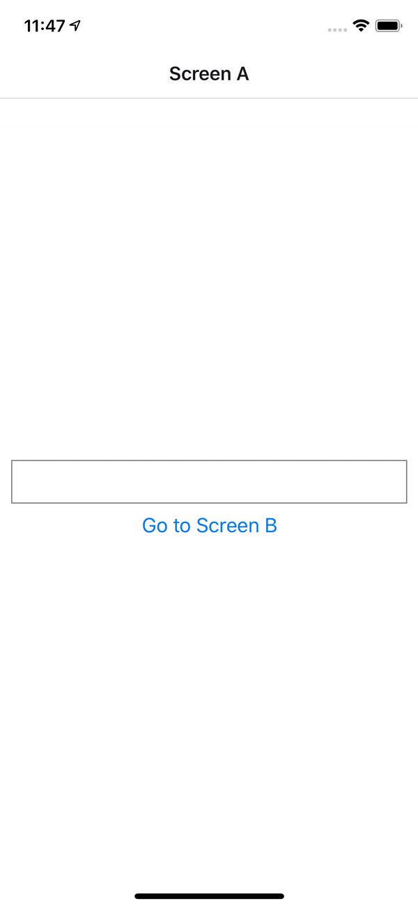
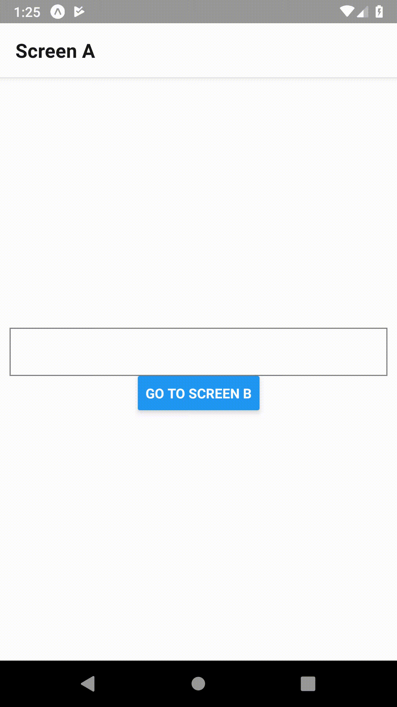

During this exercise, we will discover the [react-navigation](https://reactnavigation.org/) library allowing us to move from one screen to another. 

The final result should be as follows:

<table style="width:100%;display:table">
  <tr>
    <th>iOS</th>
    <th>Android</th>
  </tr>
  <tr>
    <td></td>
    <td></td>
  </tr>
</table>

* The very first step is to create an [app container](https://reactnavigation.org/docs/en/app-containers.html). Containers are responsible for managing the app state and linking our top-level navigator to the app environment
* Create two screens: `Screen A` and `Screen B` using a StackNavigator with the [createStackNavigator](https://reactnavigation.org/docs/en/stack-navigator.html) function: `StackNavigators` simply put every new screen on top of a stack (so you go back to the latest one on the stack etc)
* Add a title for each screen
* Implement a button to navigate from `Screen A` to `Screen B`
* Allow user to pass data (through an input) when navigating to `Screen B`