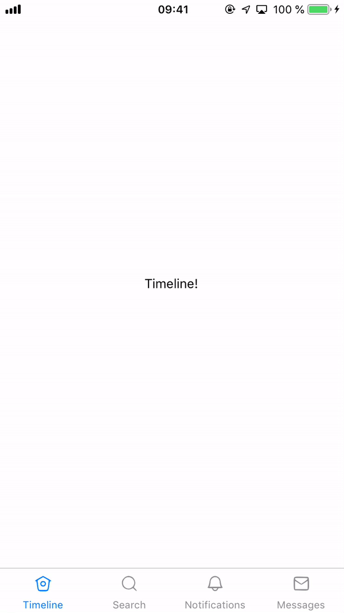
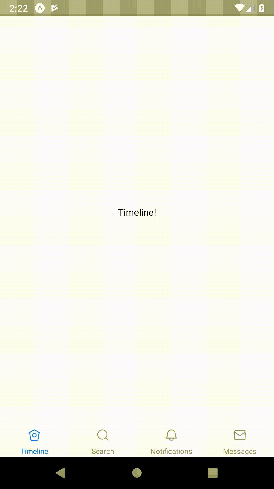

During this exercise, we will use the [react-navigation](https://reactnavigation.org/) library to implement a bottom bar navigation. You will have to:

- Create four screens using the [createBottomTabNavigator](https://reactnavigation.org/docs/en/bottom-tab-navigator.html)
- Each screen should have its own title and icon (available in this folder)
- Focused screen should have coloured title + icon

The final result should be as follow:

<table style="width:100%;display:table">
  <tr>
    <th>iOS</th>
    <th>Android</th>
  </tr>
  <tr>
    <td></td>
    <td></td>
  </tr>
</table>
