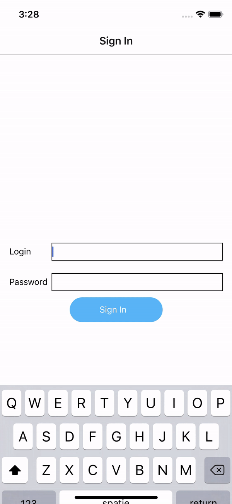
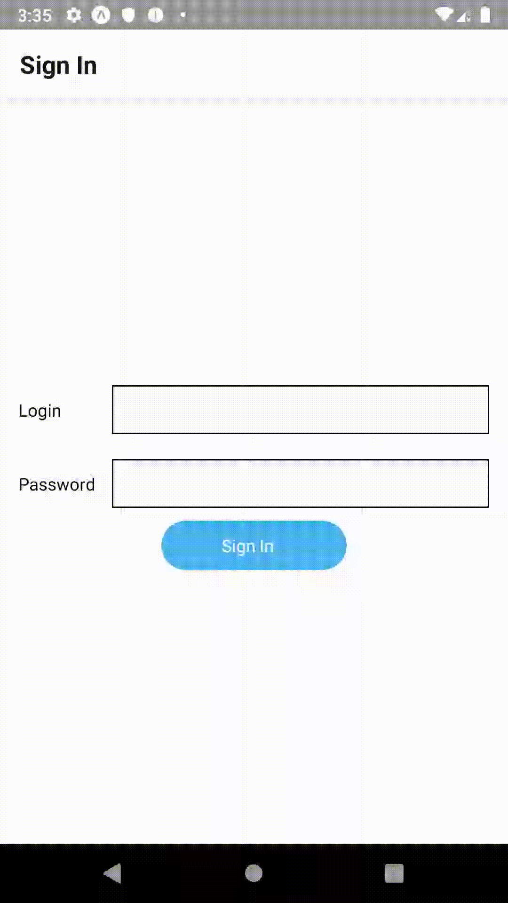

In this exercise we'll explore a little more the [react-navigation](https://reactnavigation.org/docs/en/hello-react-navigation.html) library. Our use-case will be a well-known authentication flow composed of a login screen that will direct us to a typical `home` screen.

By the end of this exercise, your application should look as follows:

<table style="width:100%;display:table">
  <tr>
    <th>iOS</th>
    <th>Android</th>
  </tr>
  <tr>
    <td></td>
    <td></td>
  </tr>
</table>

* To define a navigation structure like this with react-navigation, the general idea is to create a bunch of Navigators and nest them
* After having created our app container, we'll pass it a top-level navigator. For an authentication flow, the [SwitchNavigator](https://reactnavigation.org/docs/en/switch-navigator.html) seems to be a good fit. We want a clear separation between our `unauthenticated` and our `authenticated` screens. When a user logs in, we want to unmount the previous `unauthenticated` screens so that if he taps the `back` button, he doesn't go back to the `authentication` flow. It's exactly the behavior of a SwitchNavigator
* Pass the SwitchNavigator two [StackNavigators](https://reactnavigation.org/docs/en/stack-navigator.html) which will contain the `unauthenticated` and `authenticated` screens. Check how it's done in [this example](https://reactnavigation.org/docs/en/auth-flow.html#set-up-our-navigators)
* Make the `StackNavigator` for the `HomeScreen` wrap a [MaterialTopTabBar](https://reactnavigation.org/docs/en/material-top-tab-navigator.html) to have the tabs as shown above. By wrapping it into a `StackNavigator`, you get a nice [header bar](https://reactnavigation.org/docs/en/headers.html).
* Display user name (entered at login) in the header of the `authenticated` screen. A little trick is needed.to make it work