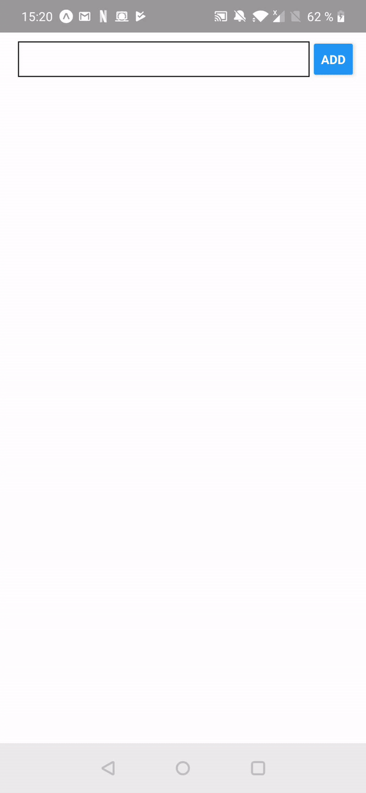

For this exercise we will implement a basic todo list that should be persisted into the decive internal memory. You will have to use the [AsyncStorage](https://docs.expo.io/versions/v34.0.0/react-native/asyncstorage) module.

The final result should be as follow:

<table style="width:100%;display:table">
  <tr>
    <th>iOS</th>
    <th>Android</th>
  </tr>
  <tr>
    <td></td>
    <td></td>
  </tr>
</table>
