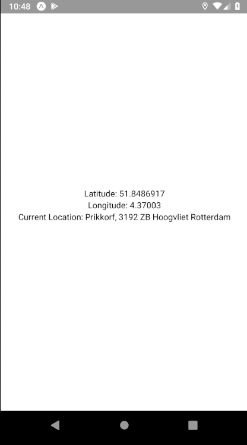

We will use, during this exercise, the [Location API](https://docs.expo.io/versions/v34.0.0/sdk/location) from expo.

As shown in the pictures below, the goal will be to:

- Display the current latitude/longitude of the mobile. You will have to use the `watchPositionAsync` function to subscribe to location updates.
- Use the `reverseGeocodeAsync` function to display the current address (based on the location)
- Finally, you will have to detect (write to the console) if the device has entered/left a specific region (latitude: `50.848692`, longitude: `4.370031`). You will have to use the `startGeofencingAsync` function.

<table style="width:100%;display:table">
  <tr>
    <th>iOS</th>
    <th>Android</th>
  </tr>
  <tr>
    <td></td>
    <td></td>
  </tr>
</table>
