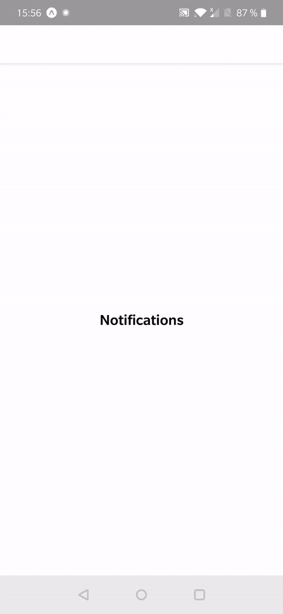

Let's look at push notifications, more specifically how to receive them and act upon their receival. We'll generally have a back-end which will call Expo to send us push notifications.

However, building a back-end isn't in the scope of this exercise, so here we'll use [Expo's push notifications tool](https://expo.io/dashboard/notifications) to send notifications to our app.

Push notifications documentation: https://docs.expo.io/versions/latest/guides/push-notifications/

By the end of this exercise, your app should look as follows:

<table style="width:100%;display:table">
  <tr>
    <th>iOS</th>
    <th>Android</th>
  </tr>
  <tr>
    <td></td>
    <td></td>
  </tr>
</table>

- Register for push notifications and receive the Expo Push Token from Expo. It's unique each time an app is installed on a device and allows your app to be identified: https://docs.expo.io/versions/latest/guides/push-notifications/#1-save-the-users-expo-push-token

- Subscribe to notifications and upon receival, navigate to another screen passing it data received from the notification
  Notifications API: https://docs.expo.io/versions/latest/sdk/notifications/

- Put the app in the background, send a notification with Expo's push notifications tool mentioned above. Normally, the transition should occur and the data should be sent to the screen you've navigated to
