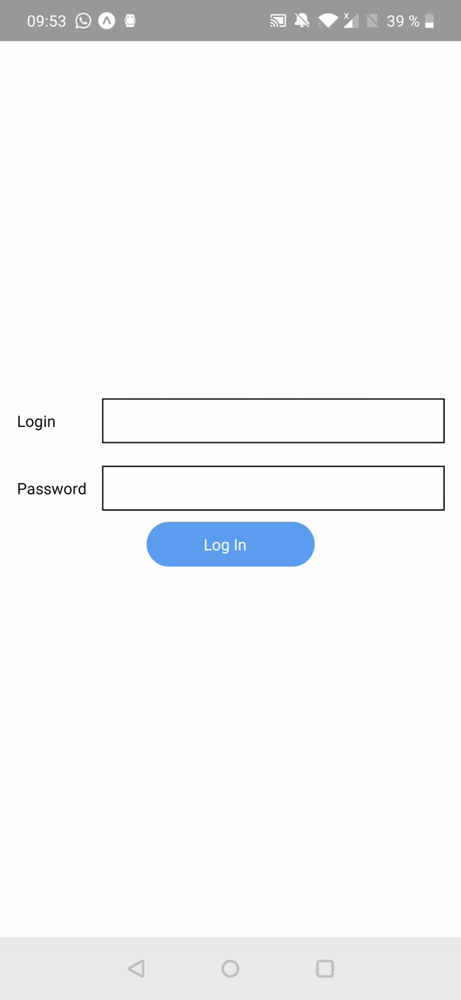
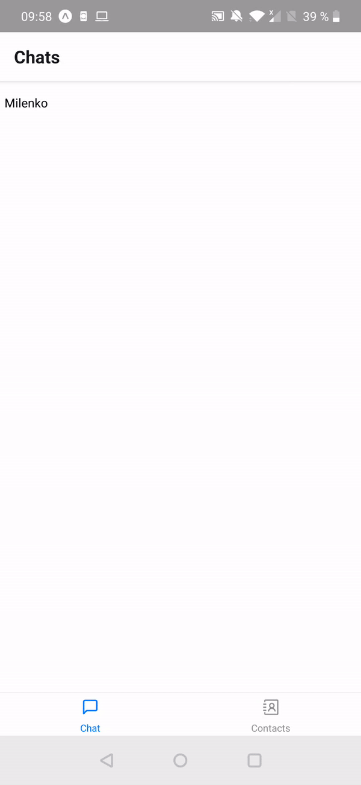
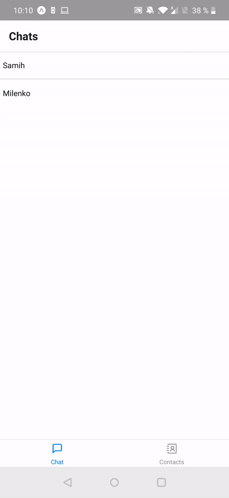

For this final exercise, we will ask you to build a mini chat from scratch. The following features should be included:

- Login with username/password
- Drawer which display info about the logged in user
- Display list of contacts
- Add a contact
- Display List of conversations
- Display a conversation and add message
- Everything should be persisted to the local storage (contacts, chats, autenticated user, ...)

<table style="width:100%;display:table">
  <tr>
    <td></td>
    <td></td>
    <td></td>
  </tr>
</table>
